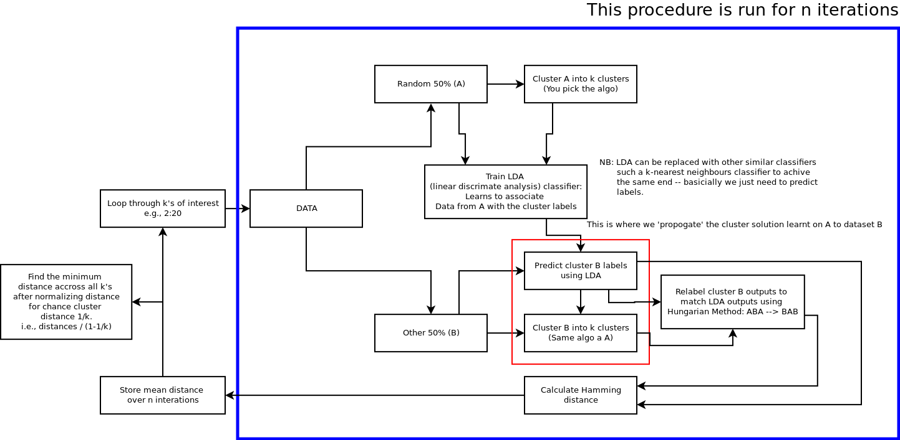

**xbrain: classify individuals into cognitive groups, or biotypes (brain/behaviour)**

A platform for conducting classification experiments using functional neuroimaging
data and out-of-scanner cognitive tests. Neuroimaging features can be a mix of
within-brain connectivity, intra-subject correlations during task / natural
viewing experiments, and other statistics derrived from external programs.

Please add this directory to your PATH. Tested with python 2.7 on Ubuntu 16.04.

This is WIP, but the basic feature set is as follows:

+ inter-subject correlation (xcorr) uses the method implemeted [here](http://journals.plos.org/plosone/article?id=10.1371/journal.pone.0041196).
+ intra-subject correlation (connectivity) uses simple between-ROI connectivity.
+ intra-subject dynamic connectivity state identification (dynamics) uses the method implemented [here](http://journal.frontiersin.org/article/10.3389/fnhum.2014.00897/full).
+ brain/behaviour groups (biotyping) uses the method implemented [here](http://www.nature.com/nm/journal/v23/n1/full/nm.4246.html).
+ performs n-fold cross validation (outer loop: test and train split).
+ performs a gridsearch for hyperparameter cross validation (inner loop: train and validation split).
+ if more than one cognitive predictor (y) is submitted, uses PCA to reduce this to a single aggregate cognitive score.
+ y can be used to split subjects into a low and high-perorming group at the desired percentile.
+ xcorr features are calculated using a template population drawn from the training set only so there is no information leakage between the training and test sets.
+ if y is discrete (e.g., diagnosis), xcorr correlates all subject's data with the target group.
+ biotyping is performed using regularized cannonical correlation analysis followed by hierarchical clustering. Details on the regularized CCA implementation [here](http://journal.frontiersin.org/article/10.3389/fninf.2016.00049/full).
+ cluster stability analysis is used to determine the most optimal number of cluster [see this](https://www.ncbi.nlm.nih.gov/pubmed/15130251) and the diagram below 

